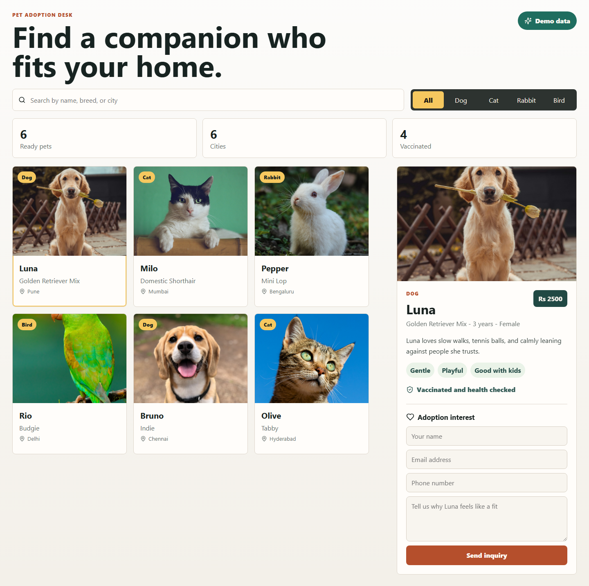
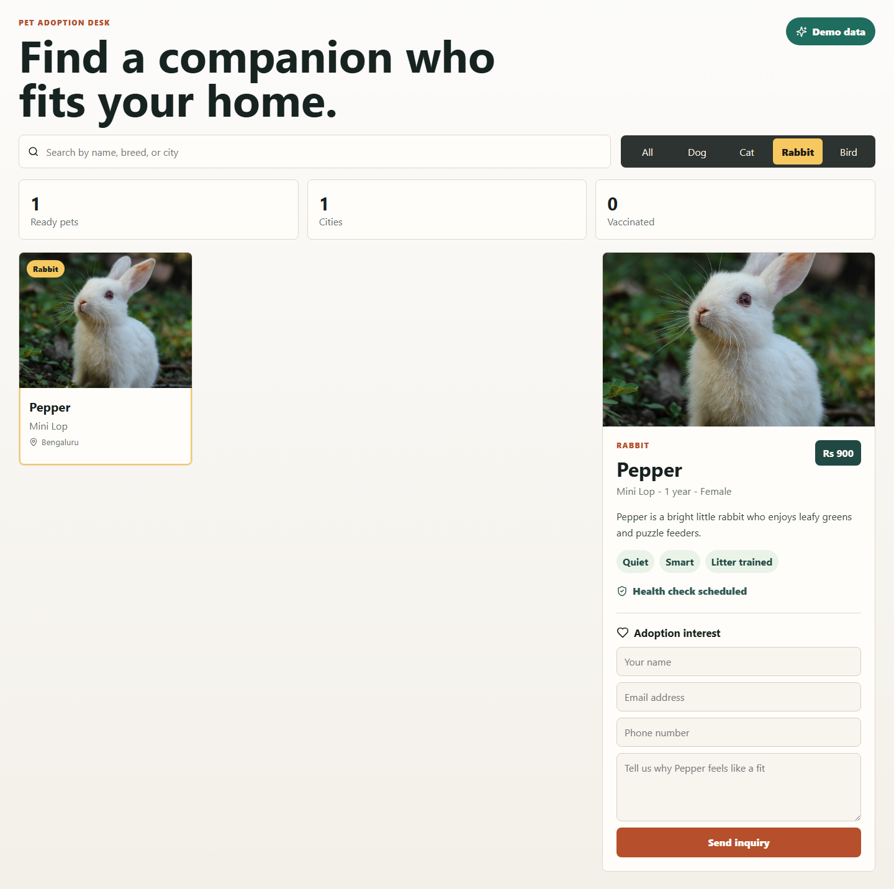

# PawFind MERN

PawFind is a full-stack pet adoption project built with MongoDB, Express, React, and Node.js.

## Features

- Browse adoptable cats, dogs, rabbits, and birds
- Search and filter pets by species
- View detailed pet profiles
- Send adoption interest inquiries
- Seed MongoDB with starter pets
- Client fallback data so the UI still works before MongoDB is running

## Quick Start

1. Install dependencies:

   ```bash
   npm.cmd run install-all
   ```

2. Copy the server environment file:

   ```bash
   copy server\.env.example server\.env
   ```

3. Start MongoDB locally or update `MONGO_URI` in `server/.env`.

4. Seed starter pets:

   ```bash
   npm.cmd run seed
   ```

5. Run the app:

   ```bash
   npm.cmd run dev
   ```

The client runs at `http://localhost:5173` and the API runs at `http://localhost:5000`.

## Scripts

```bash
npm.cmd run dev       # Run client and server together
npm.cmd run client    # Run only the React client
npm.cmd run server    # Run only the Express API
npm.cmd run seed      # Seed MongoDB with starter pets
npm.cmd run build     # Build the React client
```

## Project Structure

```text
pawfind-mern/
  client/          # React + Vite frontend
  server/          # Express + MongoDB backend
  docs/            # README screenshots
  package.json     # Root MERN scripts
```

## API Endpoints

- `GET /api/health`: API status and MongoDB connection state
- `GET /api/pets`: List available pets
- `GET /api/pets/:id`: Get a single pet
- `POST /api/pets`: Create a pet
- `POST /api/inquiries`: Submit an adoption inquiry

## Screenshots

### Adoption Dashboard



### Rabbit Filter



## Image Sources

Animal photos are downloaded from Unsplash image URLs for local demo use. Replace them with your own shelter images before production.

- Luna: `https://images.unsplash.com/photo-1552053831-71594a27632d`
- Milo: `https://images.unsplash.com/photo-1514888286974-6c03e2ca1dba`
- Pepper: `https://images.unsplash.com/photo-1585110396000-c9ffd4e4b308`
- Rio: `https://images.unsplash.com/photo-1552728089-57bdde30beb3`
- Bruno: `https://images.unsplash.com/photo-1543466835-00a7907e9de1`
- Olive: `https://images.unsplash.com/photo-1574158622682-e40e69881006`
